# Re-implementation-of-MOLI-By-Hossein-Sharifi-Noghabi-
This repository contains all files relating to my personal project of re-implementing "MOLI: multi-omics late integration with deep neural networks for drug response prediction" research paper by Hossein Sharifi-Noghabi.

## Context
MOLI (Multi-Omics Late Integration) is a deep learning architecture from Sharifi-Noghabi et al. (2019) that predicts cancer cell lines’ response to a given drug by combining three omics data types – gene expression, mutation, and copy number aberration. Features extracted from feeding each omics data type through each of its own encoders are combined via late (post-encoding) concatenation, and trained jointly with a triplet loss and a classification loss.

I chose to reimplement this because it sits exactly at my field of interest – personalized therapy where treatment decisions are guided by patient-specific characteristics (eg. molecular profile of each tumour) rather than population averages or one-size-fits-all treatment protocols. 

## Data Pipeline
### <b>Omics types used:</b>

- Gene expression (RNA-seq)
- Mutation
- Copy number aberration (CNA)
	
### <b>Key preprocessing decisions:</b>

<b> RNA-seq data</b> was reshaped from long to wide format (944 cell lines x 41143 genes), which introduced missing values for cell line-gene pairs not present in the original dataset. Missing values were handled via mean imputation for genes with less than 20% missing values; genes exceeding this threshold were dropped, to avoid replacing too large a portion of the gene’s true signal with synthetic values. 

<b>Mutation data</b> followed the same long to wide reshape (965 cell lines x 20468 genes). Missing values were imputed with 0, reflecting the binary encoding of the data where 0 indicates no cancer-driving mutation. 

<b>CNA data</b> was mapped to a signed category (+1: gain/amplification, -1: loss/deletion, 0: neutral) then reshaped from long to wide format (961 cell lines x 18000 genes) using max aggregation (aggfunc=’max’) where a gene had multiple CNA values for the same cell line. Missing values were imputed with 0, representing a neutral copy number state. 

### <b>Sample alignment</b>

Restricted to the 937 cell lines common across all three omics data types, to ensure every sample entering the model has a complete tri-omic profile.
Built separate per-drug datasets, since MOLI is trained per-drug rather than as one multi-drug model. For Gemcitabine, this resulted in 928 cell lines. 

### <b>Exploratory Data Analysis:</b>

<b>Mutation/CNA data</b> was visualized using oncoprint-style heatmaps. The mutation oncoprint displayed high mutation rates in the TP53 gene, which is to be expected as it is the most commonly mutated gene in human cancers.

<b>Gene expression data</b> was reduced to 3 principal components via Principal Component Analysis and visualized in a 3D scatter plot. Two broad clusters emerged independent of cancer type labels, suggesting either batch effects or an alternative dominant biological signal (eg. proliferation rate). 

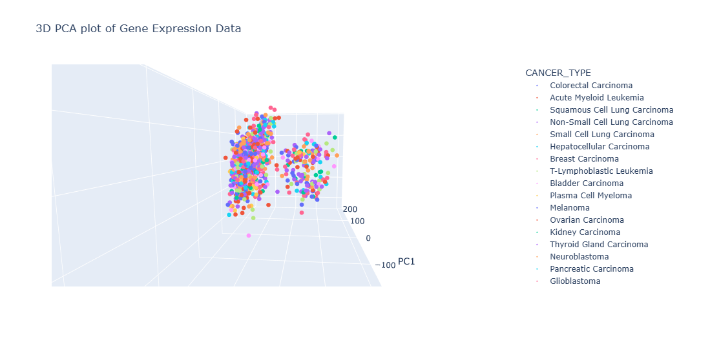
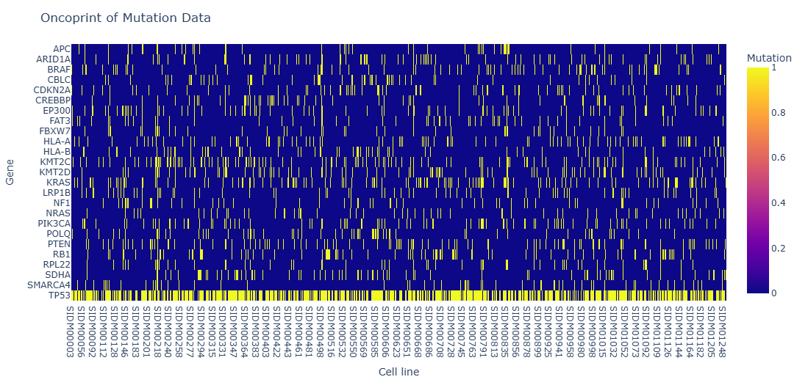
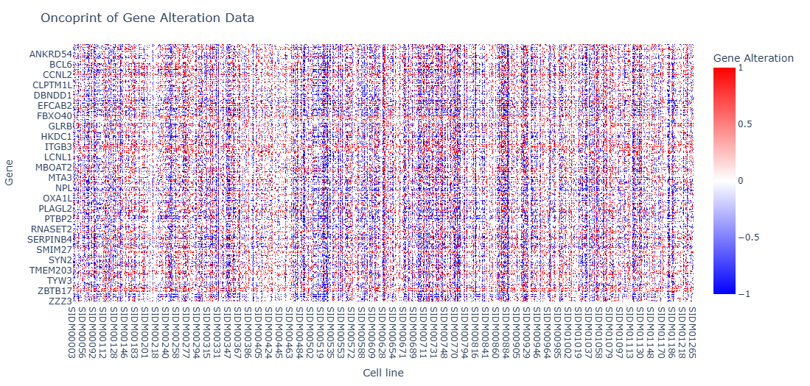

## Architecture and Mathematics

### <b>Autoencoders:</b>

Each omics data type (RNA-seq, mutation, CNA) was split into train/test sets before autoencoder training. Then, each autoencoder was trained on the train set by minimizing reconstruction loss using mean squared error:

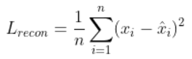

The autoencoder architecture was as follows: encoder → bottleneck (256-dimensional latent representation) → decoder. Only the encoder half of each autoencoder was retained, then used to extract 256-dimensional latent features for both train and test sets. The three encoders’ 256-dimensional outputs were concatenated into a single multi-omics representation (“late integration”) for the neural network model. 

### <b>Neural Network Architecture:</b>

The concatenated 768-dimensional multi-omics representation was fed through a classifier subnetwork with 2 hidden layers:

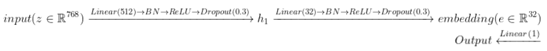

e is a 32-dimensional embedding, where triplet loss operates on. A final linear layer maps the embedding to a single logit, passed through a sigmoid to produce the drug-response probability. The classifier was trained by minimizing a combined loss function of binary-cross entropy and triplet loss (note: λ = 0.1). 

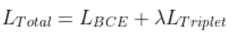

### <b>Triplet loss:</b>

Triplet loss operates on the classifier subnetwork's 32-dimensional embedding. For an anchor cell line (a), a positive (p; same drug response label as the anchor), and a negative (n; different label to the anchor), the loss uses Euclidean distance in embedding space to penalize cases where the negative is not at least the margin’s distance farther from the anchor than the positive. 

*Note: PyTorch’s TripletMarginLoss was used, and a margin (α) of 1.0 was applied.

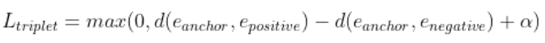

where,

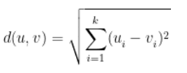

Triplet loss functions to pull embeddings of cell lines with the same drug response together, while separating cell lines with differing-response.

## Evaluation and Critical findings

### <b>Loss ablation study:</b>

Three loss configurations were compared across 5 seeds on Gemcitabine drug response: triplet + BCE (full model), BCE-only, and contrastive (pairwise) + BCE, with average AUC compared across variants. 

*Note: Contrastive loss is the pairwise alternative to triplet loss: it pulls same-response pairs together and pushes different-response pairs apart by a margin α (set to 1.0) in Euclidean space.

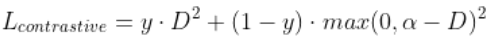

where,

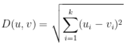
,
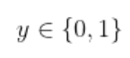

The full model (triplet + BCE) achieved an AUC of 0.696 ± 0.010, exceeding the original paper’s benchmark AUC of 0.65 on TCGA Gemcitabine data [Sharifi-Noghabi et al.]. The BCE-only variant achieved 0.706 ± 0.007, and the contrastive + BCE variant achieved 0.690 ± 0.005. All three variants fell within ~0.016 AUC of one another, with overlapping standard deviations, thus indicating no meaningful difference between the loss variants on this drug. AUC for BCE-only was slightly higher than for triplet + BCE, a direction consistent with the original paper’s pattern for Gemcitabine – though the gap in our replication (0.706 vs 0.696) was considerably smaller than theirs (0.69 vs 0.65). It should be noted that no formal significance test (eg. paired t-test across seeds) was conducted, so this comparison is directional rather than conclusive. 

### <b>Bugs & fixes:</b>

- <b>Data leakage (autoencoder stage):</b> Autoencoders were originally trained on the whole data per omics type, with the train/test split only applied after latent feature extraction. This leaked test-set information into the latent representations, despite not touching the labels directly. This was fixed by moving train/test split before autoencoder training, ensuring each autoencoder only saw the train-set during pre-training.

- <b>Data leakage (classifier stage):</b> The contrastive + BCE loss variant initially produced a suspiciously high AUC of ~0.96. This was traced to the training data being included in the test dataloader, meaning the model was being evaluated on previously seen data. This was fixed by correctly loading the test dataloader.

- <b>Model reuse across ablation variants:</b> The same model instance was initially reused across ablation variants instead of being reinitialized between runs. This caused weights learned under one loss variant to be carried over to other variants contaminating comparisons. This was fixed by re-initializing the model from scratch before training each variant.

### <b>Future work:</b>

- <b>Statistical comparison across seeds:</b> No formal significance test was conducted for the loss ablation results. Future work should include this to determine whether differences in AUC between loss variants are statistically meaningful or fall within noise. 

- <b>Further validation on TCGA data:</b> Testing the model on TCGA data, as per the original MOLI paper, would help assess whether the reimplemented model generalizes beyond the current dataset used here.

